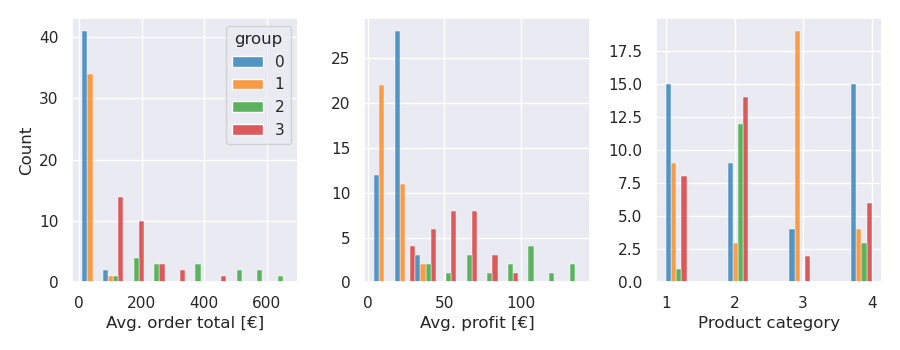

### Generate data for a simulated online-store. 

The program consist of simulated customers sending 
orders to the operational database.
The simulation-code can be run in either 
[Google-cloud functions](https://cloud.google.com/functions/),
Docker-container on a cloud platform, or locally. 
First two are preferred due to easy automation of running 
the code periodically. Operational and analysis databases 
use [Google BigQuery](https://cloud.google.com/bigquery/)
as back-end for storing the data. 
[DBT](https://www.getdbt.com/) is used for importing and 
transforming the raw data in the operational database to a form 
suitable for analyzing business-related values, such as weekly income etc.
DBT related code can be found from the repository 
[nettikauppasimulaattori-dbt](https://github.com/jamakoiv/nettikauppasimulaattori_dbt).
Code related to the review text-analysis can be found from the repository
[nettikauppasimulaattori-review](https://github.com/jamakoiv/nettikauppasimulaattori_reviews).

Original motivation for the program came after using public datasets from
[BigQuery](https://cloud.google.com/bigquery/public-data/) and
[Scikit-learn](https://scikit-learn.org/stable/datasets.html).
These datasets are presented as ready for final analysis, making them
great for learning different analyses and models, but not good for learning
the workflow importing, pre-processing, and transforming the data.

#### DBT-transformations

#### Example of KMeans-clustering with 4 clusters on data generated by approx. 130 customers. 

With this data KMeans-clustering divides the customers into groups mostly
based on the amount of money spent. Groups 0 and 1 consist of the
customers who prefer to not spend much money, while 2 and 3 are more 
liberal in their spending. Average profit per group mirrors average 
order price, which is expected since average profit is 
probably dependent value. 
Groups 0 and 1 are separated by their preferred product category, with
group 1 preferring to mainly shop category 3 goods (groceries), while
group 0 customers are more evenly shopping different product types.
Groups 2 and 3 seem quite similar, so we should re-run the clustering with
different amounts of clusters and check the clustering metrics 
(e.g. Silhouette- and Davies-Bouldin- score) to find optimal amount of clusters.

#### Review sentiment analysis

Review texts for various products were extracted from 
[verkkokauppa.com](https://www.verkkokauppa.com) and stored as raw JSON-files
on Azure CosmosDB. The reviews are imported to and processed in Databricks.

