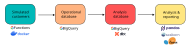
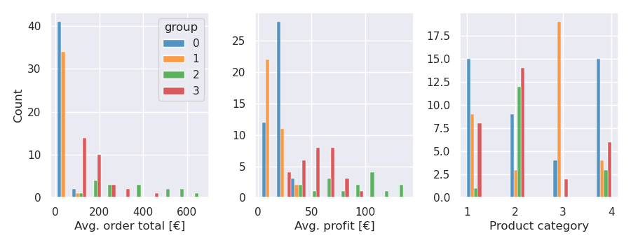
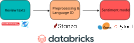
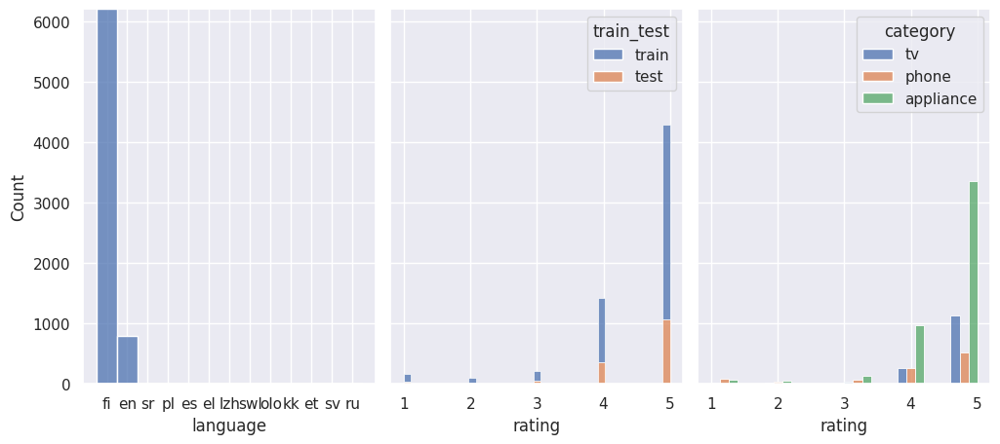
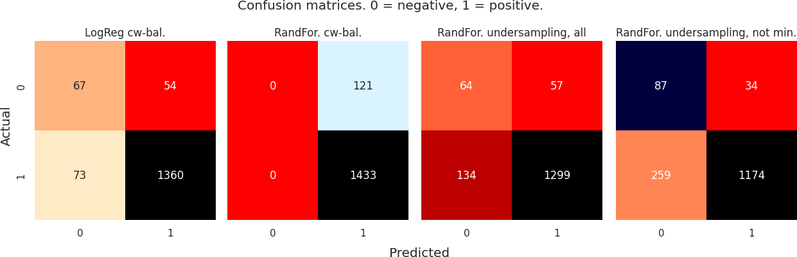
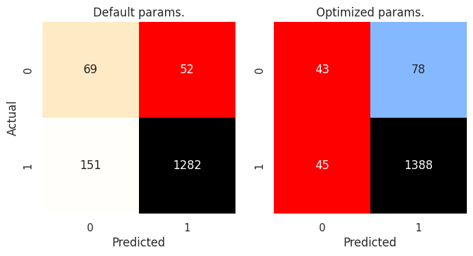

### Generate data for a simulated online-store. 

The program consist of simulated customers sending 
orders to the operational database.
The simulation-code can be run in either 
[Google-cloud functions](https://cloud.google.com/functions/),
Docker-container on a cloud platform, or locally. 
First two are preferred due to easy automation of running 
the code periodically. Operational and analysis databases 
use [Google BigQuery](https://cloud.google.com/bigquery/)
as back-end for storing the data. 
[DBT](https://www.getdbt.com/) is used for importing and 
transforming the raw data in the operational database to a form 
suitable for analyzing business-related values, such as weekly income etc.
DBT related code can be found from the repository 
[nettikauppasimulaattori-dbt](https://github.com/jamakoiv/nettikauppasimulaattori_dbt).
Code related to the review text-analysis can be found from the repository
[nettikauppasimulaattori-review](https://github.com/jamakoiv/nettikauppasimulaattori_reviews).

Original motivation for the program came after using public datasets from
[BigQuery](https://cloud.google.com/bigquery/public-data/) and
[Scikit-learn](https://scikit-learn.org/stable/datasets.html).
These datasets are presented as ready for final analysis, making them
great for learning different analyses and models, but not good for learning
the workflow importing, pre-processing, and transforming the data.

#### DBT-transformations

#### Example of KMeans-clustering with 4 clusters on data generated by approx. 130 customers. 

With this data KMeans-clustering divides the customers into groups mostly
based on the amount of money spent. Groups 0 and 1 consist of the
customers who prefer to not spend much money, while 2 and 3 are more 
liberal in their spending. Average profit per group mirrors average 
order price, which is expected since average profit is 
probably dependent value. 
Groups 0 and 1 are separated by their preferred product category, with
group 1 preferring to mainly shop category 3 goods (groceries), while
group 0 customers are more evenly shopping different product types.
Groups 2 and 3 seem quite similar, hinting that there is more optimal cluster number which could be explored using the clustering metrics, e.g. Silhouette- or Davies-Bouldin-score.

#### Review sentiment analysis

Review texts for various products were extracted from 
[verkkokauppa.com](https://www.verkkokauppa.com) and stored as raw JSON-files
on Azure CosmosDB. The reviews are imported to and processed in Databricks.

From about 1000 products in three different categories, we get approximately 7000
reviews. Of these majority are in Finnish language, as expected for a finnish store.
The most obvious problem with the dataset is the very strong imbalance in 
the product ratings. Vast majority of the reviews are positive, rating 4 or 5, 
with only a small fraction being neutral or negative.
We must make sure that this imbalance is preserved in every step or otherwise we might end up with e.g. training-set which has practically no negative reviews.

For classification we tried simple logistical regression and random forest classifier -models. To address the imbalanced dataset we tried using balanced class-weights, and undersampling the dataset positive and negative. Without any method to mitigate the imbalance, all models simply labeled every review positive. 

In the confusion matrices we can visually see model accuracies with correctly predicted classes in the matrix diagonal (top-left to bottom-right) and incorrect predictions on the anti-diagonal (bottom-left to top-right).

Regular logistic regression model with balanced class-weights performs well for such a simple model. Meanwhile, with only class-weight balancing, the random forest classifier fails completely and labels the entire test set as positive.
The undersampling random forest classifiers give better results but tend to overstate the minority negative class, leading in an increase in false negatives, especially when undersampling only the majority positive class (not.min.)

Originally the logistic regression was included to highlight how simpler models fail with complicated datasets, but in this case it turned out to perform on par or better than the more complex random forest models.

A simple neural-net based classifier was also tried using PyTorch, but the performance was similar with the above models.
