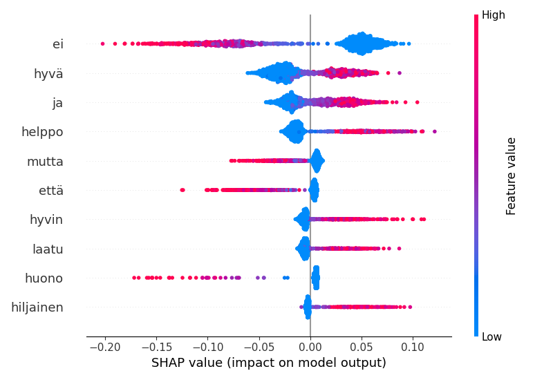

## Demonstrate basic data-analysis and data-engineering skills using a simulated online-store.

The project consist of two parts: 

1. Online store with operational database containing raw orders from customers. The data from operational database is aggregated and transformed into analytical database, and basic customer analysis is performed.

2. Creating sentiment classification-model from product review texts.

Original motivation for the program came after using public datasets from
[BigQuery](https://cloud.google.com/bigquery/public-data/) and
[Scikit-learn](https://scikit-learn.org/stable/datasets.html).
These datasets are presented as ready for final analysis, making them
great for learning different analyses and models, but not good for learning
the workflow importing, pre-processing, and transforming the data.

### Simulated online-store.

Periodic code simulates customers who send orders to to the store. 
These are stored in an operational database, which is periodically
imported and transformed into analytical database.

The simulation-code can be run in either 
[Google-cloud functions](https://cloud.google.com/functions/),
Docker-container on a cloud platform, or locally. 
Both operational and analytical databases are implemented as relational databases using [Google BigQuery](https://cloud.google.com/bigquery/) as back-end. 
[DBT](https://www.getdbt.com/) is used for importing and 
transforming the raw data in the operational database to a form 
suitable for analyzing business-related information.
DBT related code can be found from the repository 
[nettikauppasimulaattori-dbt](https://github.com/jamakoiv/nettikauppasimulaattori_dbt).

#### Example of KMeans-clustering on approx. 130 customers. 

KMeans-clustering divides the customers into groups mostly
based on the amount of money spent. Groups 0 and 1 consist of the
customers who prefer to not spend much money, while 2 and 3 are more 
liberal in their spending. Average profit per group mirrors average 
order price, which is expected since average profit is 
probably dependent variable. 
Groups 0 and 1 are separated by their preferred product category, with
group 1 preferring to mainly shop category 3 goods (groceries), while
group 0 customers are more evenly shopping different product types.
Groups 2 and 3 seem quite similar, hinting that there is more optimal cluster number which could be explored using the clustering metrics, e.g. [Silhouette- or Davies-Bouldin](https://scikit-learn.org/stable/auto_examples/cluster/plot_kmeans_silhouette_analysis.html)-score.

### Review sentiment analysis

Review texts for various products were extracted from 
[verkkokauppa.com](https://www.verkkokauppa.com) and stored as raw JSON-files
on [Azure CosmosDB](https://learn.microsoft.com/en-us/azure/cosmos-db/). The reviews are imported to and processed in Databricks.

#### Preprocessing

From about 1000 products in three different categories, we get approximately 7000
reviews. Of these majority are in Finnish language, as expected for a finnish store.
The most obvious problem with the dataset is the very strong imbalance in 
the product ratings. Vast majority of the reviews are positive, rating 4 or 5, 
with only a small fraction being neutral or negative.
We must make sure that this imbalance is preserved in every step or otherwise we might end up with e.g. training-set which has practically no negative reviews.

The review texts were lemmatized and non-informative word categories removed using [Stanza](https://stanfordnlp.github.io/stanza/) NLP-package. These steps help to reduce the number of different words which in turn reduces the resulting parameter space.
For text vectorization the [bag-of-words](https://en.wikipedia.org/wiki/Bag-of-words_model) model was selected, mainly due the models simplicity and low computational cost.
Text vectorization and conversion from word counts to [term frequency-inverse document frequency (TF-IDF)](https://en.wikipedia.org/wiki/Tf%E2%80%93idf) values was performed with scikit-learn.

#### Classification models

For classification we tried simple logistical regression and random forest classifier -models. To address the imbalanced dataset we tried using balanced class-weights, and undersampling the dataset positive and negative. Without any method to mitigate the imbalance, all models simply labeled every review positive. 

In the confusion matrices we can visually see model accuracies with correctly predicted classes in the matrix diagonal (top-left to bottom-right) and incorrect predictions on the anti-diagonal (bottom-left to top-right).

Regular logistic regression model with balanced class-weights performs well for such a simple model. Meanwhile, with only class-weight balancing, the random forest classifier fails completely and labels the entire test set as positive.
The undersampling random forest classifiers give better results but tend to overstate the minority negative class, leading in an increase in false negatives, especially when undersampling only the majority positive class (not.min.)

Originally the logistic regression was included to highlight how simpler models fail with complicated datasets, but in this case it turned out to perform on par or better than the more complex random forest models.

For the undersampling random forest classifier a hyperparameter optimization was performed using [Optuna](https://optuna.org/) and [MLFlow](https://mlflow.org/). The optimized model does improve the results slightly, giving less false negatives than with the default parameters, but there is no major difference between the results.

A simple neural-net based classifier was also tried using PyTorch, but the performance was similar with the above models.

The contributions of different words to the model prediction can be analysed using [SHAP](https://shap.readthedocs.io/en/latest/index.html).
For binary classification model the SHAP analysis gives values for each feature on how much the feature is pushing the model towards positive or negative class, 
with negative SHAP-value pushing the model towards negative class and positive SHAP-value pushing the model towards positive-class.
In the above plot the feature value shows the occurance of the word with high occurance meaning the word occurs frequently.
In the above plot are 10 most significant words with their SHAP-values.
We can quickly see that words with negative connotation, like "ei [no]" and "huono [bad]" give negative SHAP-values, and words like "hyvä [good]" and "helppo [easy]" give positive SHAP-values, as expected. 
Some words like "ja [and]", "mutta [but]", "että [that]" are mostly neutral, but give sizable contribution in the model.
Most words give strongly lopsided distributions, the presence of the word gives strong contribution to the model, but the absence of the word does not affect the model. 
This is probably due to either the vocabulary being different in the positive and negative reviews, or the sample size being too small.
